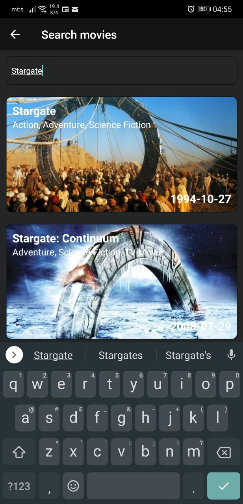
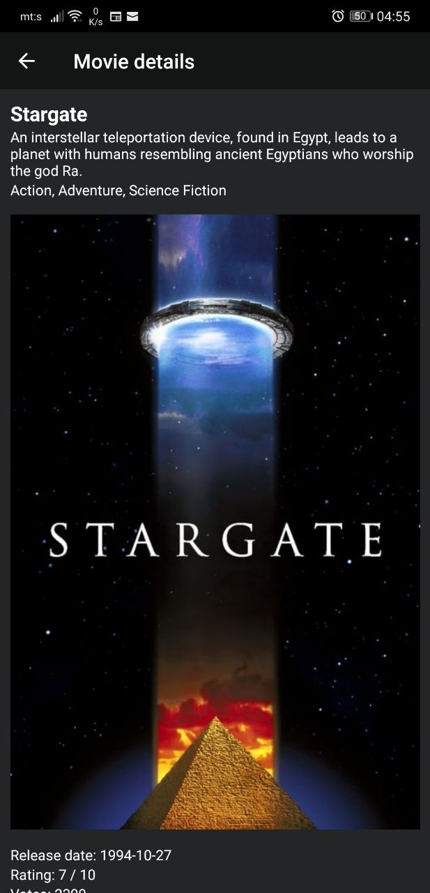

# Movies App
Movies app displaying upcoming movies from TMDb

## Setting up development environment
* Install node, yarn
* Install Android Studio, XCode
* Editor VSCode
* Extensions: Eslint, prettier

## CI/CD
Github actions have been configured to validate the code before deployment to firebase. It runs yarn install, lint, test, builds and publishes the apk.
To request access to the distribution group for easier app testing follow https://appdistribution.firebase.dev/i/49ae9167880efcaf

## Getting Started
Before running any of the scripts listed bellow, it is necessary to have all the packages installed, a.k.
a. yarn

* Scripts:
  * yarn start -> starts the development server. However, it wont have an api key, therefore, I suggest the following command: npx cross-env API_KEY={API_KEY} yarn start
  * yarn test -> runs the unit tests.
  * yarn test:coverage -> prints out the coverage in the terminal and generates the report.
  * yarn test:coverage:open -> displays the code coverage in a browser.
  * yarn lint -> goes through the code and checks for linting issues.
  * yarn lint:types -> goes through the code and checks for typescript violations.
  * yarn lint:fix -> goes through the code and checks for linting issues and fixes them where possible.
  * yarn clean:android -> cleans the android project artifacts, requires gradlew sync afterwards.
  * yarn build:android -> builds the release apk.

## Third party libraries
* styled-components -> easy parametrization of css for making re usable building blocks
* typescript -> superset of javascript, introduces type definitions.
* react-navigation -> navigation library
* react-native-toast-message -> used for displaying toast message
* eslint -> static analyzer, validates code against defined rules
* jest -> test runner
* testing-library/react-native -> testing library for react components

## Screenshots

